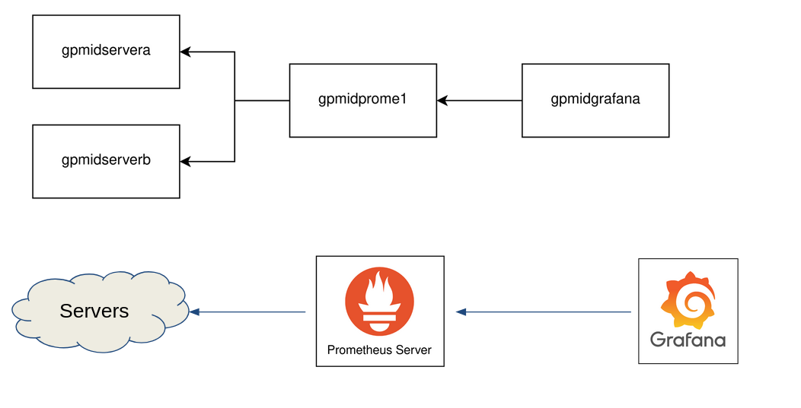
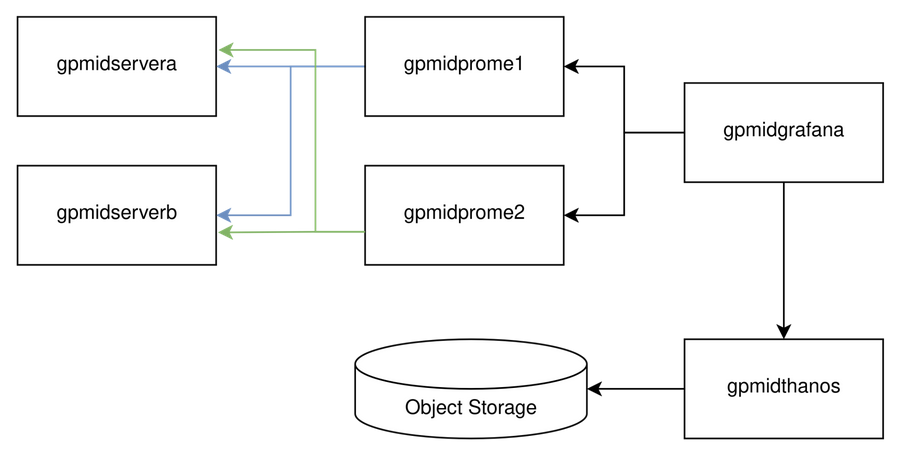
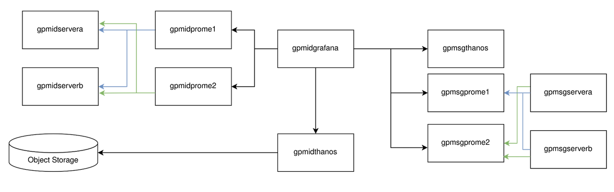

# Deployment Demo of Distributed Prometheus with Thanos on OpenSUSE servers

The distributed system is deployed using two regions, which consists of Indonesia Region and Singapore Region and simulated with KVM.

Prerequisites:

You should deploy the underlying target servers first using this [README.md](deployments/clients/README.md).

When using *deploy.sh*, ensure that the IP Address are changed if you have different network setup than defined in this repository

There are four scenarios to try on:

## Scenario 1: Typical Node Exporter - Prometheus - Grafana deployment


Refer to the tutorial [README.md](deployments/scenario1/README.md) to provision the VMs, then you can follow the tutorial below.

### Deploying the environment

Go to the deployment [folder](podman/scenario1).
```bash
cd podman/scenario1
```

Simply run the script to deploy the Prometheus and Grafana Environment:
```bash
bash deploy.sh
```

When needs to cleanup the environment, run this script:
```bash
bash cleanup.sh
```

## Scenario 2: Adding another prometheus replica with Thanos Sidecar and Thanos Query


Refer to the tutorial [README.md](deployments/scenario2/README.md) to provision the VMs, then you can follow the tutorial below.

### Deploying the environment

Go to the deployment [folder](podman/scenario2).
```bash
cd podman/scenario2
```

Simply run the script to deploy the Prometheus with Thanos and Grafana Environment:
```bash
bash deploy.sh
```

When needs to cleanup the environment, run this script:
```bash
bash cleanup.sh
```

## Scenario 3: Applying Object Storage Data Retention with rustFS, Thanos Store Gateway, and Thanos Compact


Refer to the tutorial [README.md](deployments/scenario3/README.md) to provision the VMs, then you can follow the tutorial below.

### Deploying the environment

Go to the deployment [folder](podman/scenario3).
```bash
cd podman/scenario3
```

Deploy the rustfs in your laptop to represent external datacenter in your environment. Feel free to change the access key and secret key there:
```bash
bash deploy-rustfs.sh
```

Ensure that all VMs are able to reach internet. You might want to add extra iptables rules to masquerade the network:
```bash
iptables -t nat -A POSTROUTING -s <your network ip subnet> -j MASQUERADE
```

Then run the script to deploy the Prometheus with Thanos with Thanos Store Gateway, Thanos Compact and Grafana Environment:
```bash
bash deploy.sh
```

When needs to cleanup the environment, run this script:
```bash
bash cleanup.sh
```

## Scenario 4: Applying Object Storage Data Retention with rustFS, Thanos Store Gateway, and Thanos Compact


Refer to the tutorial [README.md](deployments/scenario4/README.md) to provision the VMs, then you can follow the tutorial below.

Ensure that the networks are able to reach each other (from virbr1 to virbr2 and vice-versa). Ensure that all VMs are able to reach internet. You might want to add extra iptables rules to masquerade the network:
```bash
iptables -t nat -A POSTROUTING -s <your network ip subnet> -j MASQUERADE
```

Then run the script to deploy the Prometheus with Thanos with Thanos Store Gateway, Thanos Compact and Grafana Environment:
```bash
bash deploy.sh
```

When needs to cleanup the environment, run this script:
```bash
bash cleanup.sh
```