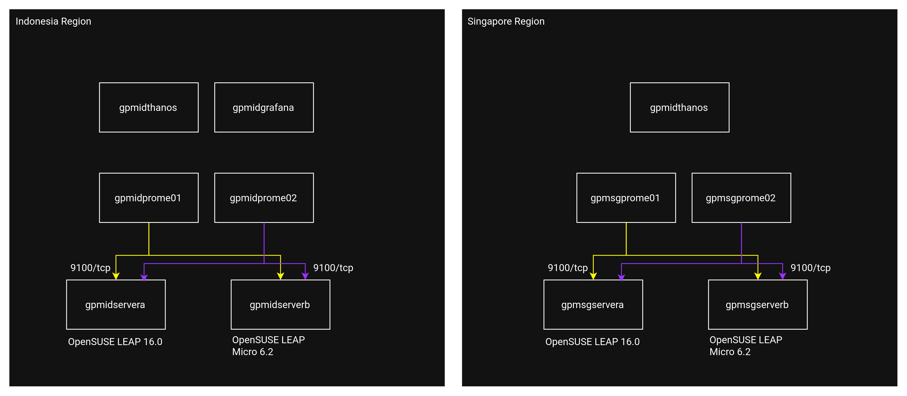
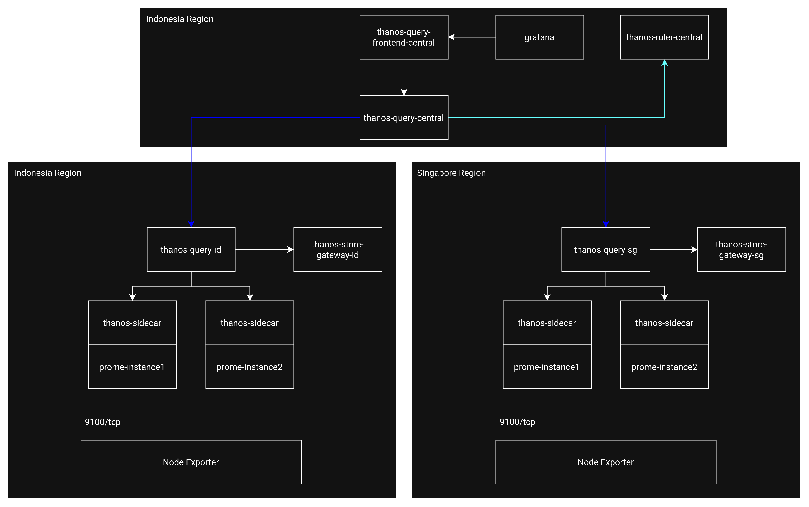

# opensuse-prometheus-thanos
Deployment of Distributed Prometheus with Thanos on OpenSUSE servers

The distributed system is deployed using two regions, which consists of Indonesia Region and Singapore Region and simulated with KVM.

The physical diagram is shown below:

Thw logical diagram is show below:
