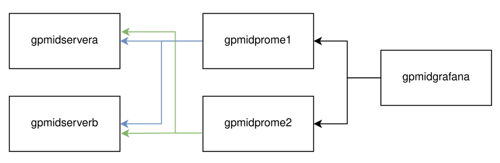

## Scenario 2: Adding another prometheus replica with Thanos Sidecar and Thanos Query


Refer to the tutorial [README.md](../../deployments/scenario2/README.md) to provision the VMs, then you can follow the tutorial below.

### Deploying the environment

Simply run the script to deploy the Prometheus with Thanos and Grafana Environment:
```bash
bash deploy.sh
```

When needs to cleanup the environment, run this script:
```bash
bash cleanup.sh
```
